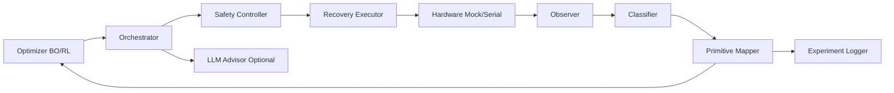

# AUTOGLITCH

[](#설치)
[](https://github.com/R00T-Kim/autoglitch/actions/workflows/ci.yml)
[](https://github.com/R00T-Kim/autoglitch/actions/workflows/codeql.yml)
[](https://github.com/R00T-Kim/autoglitch/actions/workflows/semgrep.yml)
[](#운영-예시)

AUTOGLITCH는 fault injection 실험을 자동화하는 closed-loop 프레임워크입니다.  
파라미터 탐색(BO/RL), 실험 실행, 관측/분류, primitive 매핑, 재현성 리포트를 한 흐름으로 제공합니다.

## 핵심 기능
- `run`: 단일 캠페인 실행
- `soak`: 장시간 배치 실행 + 체크포인트/재개
- `queue-run`: 다중 job 실행 (`priority`, `enabled`, 체크포인트/재개)
- `benchmark`: 알고리즘 비교 (bayesian vs rl)
- `replay`: JSONL trial 로그 재집계/검증
- 안전/복구: safety guard + retry/circuit-breaker
- 비동기 serial 세션 재사용 + 재연결(`keep_open`, `reconnect_attempts`)
- 리포트 스키마 v4: latency/p95/throughput + Pareto front + optimizer telemetry

## 최근 업데이트 (2026-03-05)
- Async serial persistent/reconnect 상태머신 도입
- BO heuristic 벡터화 평가 + 런타임 telemetry 추가
- 캠페인 요약 `schema_version: 4` 업그레이드
- 상세 내역: [`docs/PLAN_IMPLEMENTATION_STATUS.md`](docs/PLAN_IMPLEMENTATION_STATUS.md)

## 프로젝트 구조
- `src/`: 오케스트레이터, optimizer, hardware, runtime, safety, CLI
- `configs/`: 기본/타깃 설정
- `experiments/configs/`: repro/soak/queue 템플릿
- `experiments/logs`, `experiments/results`: 실행 산출물
- `tests/`: unit/integration 테스트
- `docs/`: 운영/설계 문서

## 설치
```bash
python -m venv .venv
source .venv/bin/activate
python -m pip install -e ".[dev]"
```

## 빠른 시작
```bash
python -m src.cli validate-config --target stm32f3
python -m src.cli run --target stm32f3 --trials 100
python -m src.cli report
```

## 장비 없이 serial 경로 테스트
```bash
python -m src.tools.mock_glitch_bridge --port-file /tmp/autoglitch_mock_bridge.port
python -m src.cli run --hardware serial --serial-port "$(cat /tmp/autoglitch_mock_bridge.port)" --trials 20
```

## 라즈베리파이 GPIO 브리지
```bash
python -m src.tools.rpi_glitch_bridge \
  --control-port /dev/ttyUSB0 \
  --glitch-pin 18 --reset-pin 23 --trigger-out-pin 24 --active-high
```

## 아키텍처 다이어그램


상세 설명: [`docs/ARCHITECTURE.md`](docs/ARCHITECTURE.md)

## 운영 예시
```bash
# soak + resume
python -m src.cli soak --template experiments/configs/soak_hil_stm32f3.yaml --batch-trials 200 --max-batches 20
python -m src.cli soak --template experiments/configs/soak_hil_stm32f3.yaml --batch-trials 200 --max-batches 20 --resume

# queue + priority/checkpoint
python -m src.cli queue-run --queue experiments/configs/queue_hil.yaml --continue-on-error
python -m src.cli queue-run --queue experiments/configs/queue_hil.yaml --resume
```

> `serial` 타깃 병렬 실행은 기본 차단됩니다. 필요한 경우에만 `--allow-parallel-serial`을 명시하세요.

### 성능 튜닝 옵션 (config)
```yaml
optimizer:
  bo:
    candidate_pool_size: 192
    vectorized_heuristic: true

hardware:
  serial:
    io_mode: async
    keep_open: true
    reconnect_attempts: 2
    reconnect_backoff_s: 0.05
```

### 리포트 확인 포인트 (v4)
- `runtime.throughput_trials_per_second`
- `latency.mean_seconds / p95_seconds / max_seconds`
- `pareto_front`
- `optimizer_runtime`

## 품질 확인
```bash
python -m compileall src tests
ruff check src tests
python -m mypy src
pytest -q
```

## 문서
- `docs/RUNBOOK.md`
- `docs/SAFETY.md`
- `docs/PLUGIN_SDK.md`
- `docs/ARCHITECTURE.md`
- `docs/ROADMAP.md`
- `docs/PLAN_IMPLEMENTATION_STATUS.md`
