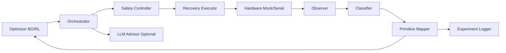

# AUTOGLITCH

[](#설치)
[](https://github.com/R00T-Kim/autoglitch/actions/workflows/ci.yml)
[](https://github.com/R00T-Kim/autoglitch/actions/workflows/codeql.yml)
[](https://github.com/R00T-Kim/autoglitch/actions/workflows/semgrep.yml)
[](#운영-예시)

AUTOGLITCH는 fault injection 실험을 자동화하는 closed-loop 프레임워크입니다.  
파라미터 탐색(BO/RL), 실험 실행, 관측/분류, primitive 매핑, 재현성 리포트를 한 흐름으로 제공합니다.

## 핵심 기능
- `run`: 단일 캠페인 실행
- `soak`: 장시간 배치 실행 + 체크포인트/재개
- `queue-run`: 다중 job 실행 (`priority`, `enabled`, 체크포인트/재개)
- `benchmark`: 알고리즘 비교 (bayesian vs rl)
- `train-rl`: RL 백엔드 학습/체크포인트 생성
- `eval-rl`: RL 체크포인트 평가
- `run-agentic`: planner/policy를 포함한 agentic 실행 루프
- `planner-step`: 단일 planner 제안 + policy 검증
- `eval-suite`: 재현성 스위트 실행
- `kb-ingest`, `kb-query`: 로컬 지식 저장소 적재/조회
- `replay`: JSONL trial 로그 재집계/검증
- `hil-preflight`: serial HIL 사전 안정성 점검(timeout/reset/p95 latency)
- 안전/복구: safety guard + retry/circuit-breaker
- 비동기 serial 세션 재사용 + 재연결(`keep_open`, `reconnect_attempts`)
- 리포트 스키마 v6: v5 + agentic decision trace/policy metrics

## 최근 업데이트 (2026-03-06, Phase 4)
- Async serial persistent/reconnect 상태머신 도입
- 이미 실행 중인 event loop 안에서도 동작하는 async serial sync-wrapper 적용
- BO heuristic 벡터화 평가 + 런타임 telemetry 추가
- BO backend 확장(`turbo`, `qnehvi`) + objective mode(`single|multi`)
- RL `train-rl`/`eval-rl` 명령 및 checkpoint/eval 경로 추가
- Agentic Planner/Policy 루프(`off|advisor|agentic_shadow|agentic_enforced`) 추가
- Agentic typed policy 검증 + live/next_run patch metadata + JSONL decision trace 추가
- `run-agentic`, `planner-step`, `eval-suite`, `kb-ingest`, `kb-query` 추가
- 캠페인 요약 `schema_version: 6` 업그레이드
- `hil-preflight` 커맨드 + `--require-preflight` 게이트 도입
- strict config `config_version: 2` + `recovery`/`ext_offset` schema/safety 검증 추가
- run/queue/soak cleanup 및 serial 병렬 차단 로직 강화
- CI는 broad smoke + upgraded subsystem incremental gates로 정렬
- 상세 내역: [`docs/PLAN_IMPLEMENTATION_STATUS.md`](docs/PLAN_IMPLEMENTATION_STATUS.md)

현재 소프트웨어 검증 상태(2026-03-06):
- `pytest -q` → `93 passed, 2 skipped`
- strict/legacy config regression, agentic trace, async serial running-loop regression 포함

## 프로젝트 구조
- `src/`: 오케스트레이터, optimizer, hardware, runtime, safety, CLI
- `configs/`: 기본/타깃 설정
- `experiments/configs/`: repro/soak/queue 템플릿
- `experiments/logs`, `experiments/results`: 실행 산출물
- `tests/`: unit/integration 테스트
- `docs/`: 운영/설계 문서

## 설치
```bash
python -m venv .venv
source .venv/bin/activate
python -m pip install -e ".[dev]"
```

## 빠른 시작
```bash
python -m src.cli validate-config --target stm32f3
python -m src.cli run --target stm32f3 --trials 100
python -m src.cli report
```

## 장비 없이 serial 경로 테스트
```bash
python -m src.tools.mock_glitch_bridge --port-file /tmp/autoglitch_mock_bridge.port
python -m src.cli run --hardware serial --serial-port "$(cat /tmp/autoglitch_mock_bridge.port)" --trials 20
```

## 라즈베리파이 GPIO 브리지
```bash
python -m src.tools.rpi_glitch_bridge \
  --control-port /dev/ttyUSB0 \
  --glitch-pin 18 --reset-pin 23 --trigger-out-pin 24 --active-high
```

## 아키텍처 다이어그램


상세 설명: [`docs/ARCHITECTURE.md`](docs/ARCHITECTURE.md)

## 운영 예시
```bash
# HIL preflight + 강제 실행
python -m src.cli hil-preflight --target stm32f3 --hardware serial --serial-port /dev/ttyUSB0
python -m src.cli run --template experiments/configs/soak_hil_stm32f3.yaml --hardware serial --serial-port /dev/ttyUSB0 --require-preflight

# RL train / eval
python -m src.cli train-rl --target stm32f3 --rl-backend sb3 --steps 5000 --run-tag rl_baseline
python -m src.cli eval-rl --target stm32f3 --rl-backend sb3 --checkpoint experiments/results/rl_sb3_checkpoint_step_5000_train_final.json

# Agentic shadow/enforced
python -m src.cli run-agentic --template experiments/configs/repro_stm32f3.yaml --ai-mode agentic_shadow
python -m src.cli run-agentic --template experiments/configs/repro_stm32f3.yaml --ai-mode agentic_enforced --policy-file configs/policy/default_policy.yaml

# Planner 단일 검증
python -m src.cli planner-step --target stm32f3 --ai-mode agentic_enforced --success-rate 0.05 --primitive-rate 0.01

# soak + resume
python -m src.cli soak --template experiments/configs/soak_hil_stm32f3.yaml --batch-trials 200 --max-batches 20
python -m src.cli soak --template experiments/configs/soak_hil_stm32f3.yaml --batch-trials 200 --max-batches 20 --resume

# queue + priority/checkpoint
python -m src.cli queue-run --queue experiments/configs/queue_hil.yaml --continue-on-error
python -m src.cli queue-run --queue experiments/configs/queue_hil.yaml --resume
```

> `serial` 타깃 병렬 실행은 기본 차단됩니다. 필요한 경우에만 `--allow-parallel-serial`을 명시하세요.

### 설정 버전/호환성
- strict 모드는 **`config_version: 2`** 를 요구합니다.
- legacy 모드는 구설정 마이그레이션 확인용이며, malformed 입력도 **에러 리스트 반환**을 목표로 합니다.
- `ext_offset`, `recovery.*`, agentic policy metadata는 v2 기준입니다.

### 성능 튜닝 옵션 (config)
```yaml
ai:
  mode: agentic_shadow
  planner_interval_trials: 50
  max_patch_delta: 0.5
  max_actions_per_cycle: 3
  confidence_threshold: 0.25

policy:
  allowed_fields:
    - optimizer.bo.candidate_pool_size
    - optimizer.bo.objective_mode
    - optimizer.bo.multi_objective_weights.*

optimizer:
  bo:
    backend: turbo   # auto|heuristic|botorch|turbo|qnehvi
    objective_mode: multi
    multi_objective_weights:
      reward: 1.0
      exploration: 0.5
    candidate_pool_size: 192
    vectorized_heuristic: true
  rl:
    backend: sb3
    warmup_steps: 256
    eval_interval: 1000
    save_best_only: false
    checkpoint_dir: experiments/results

hardware:
  serial:
    io_mode: async
    keep_open: true
    reconnect_attempts: 2
    reconnect_backoff_s: 0.05
    preflight:
      enabled: true
      probe_trials: 30
      max_timeout_rate: 0.05
      max_reset_rate: 0.10
      max_p95_latency_s: 0.50
```

### 리포트 확인 포인트 (v6)
- `runtime.throughput_trials_per_second`
- `latency.mean_seconds / p95_seconds / max_seconds`
- `pareto_front`
- `reproducibility.config_hash_sha256 / git_sha / python_version`
- `objective_summary.mode / multi_objective_weights`
- `agentic.mode / event_count / policy_reject_count`
- `decision_trace`
- `training.optimizer_backend / observed_steps`
- `optimizer_runtime`

## 품질 확인
```bash
python -m compileall src tests
ruff check src tests --select E,F --ignore E501
ruff check --select E,F,I,SIM --ignore E501 \
  src/agentic \
  src/cli_agentic.py \
  src/cli_batch.py \
  src/cli_commands.py \
  src/cli_execution.py \
  src/cli_parser.py \
  src/cli_preflight.py \
  src/cli_runtime.py \
  src/cli_support.py \
  src/config/schema.py \
  src/config/validator.py \
  src/safety/controller.py \
  src/hardware/serial_async_hardware.py \
  src/hardware/serial_hardware.py \
  src/plugins/registry.py \
  src/types.py \
  tests/unit/test_agentic_policy.py \
  tests/unit/test_agentic_trace.py \
  tests/unit/test_cli_agentic.py \
  tests/unit/test_cli_advanced_modes.py \
  tests/unit/test_cli_helpers.py \
  tests/unit/test_cli_preflight.py \
  tests/unit/test_cli_rl_commands.py \
  tests/unit/test_rl_backends.py \
  tests/unit/test_config_schema.py \
  tests/unit/test_plugin_registry.py \
  tests/unit/test_safety_controller.py \
  tests/unit/test_serial_async_hardware.py
python -m mypy --follow-imports=silent \
  src/cli_agentic.py \
  src/cli_batch.py \
  src/cli_commands.py \
  src/cli_execution.py \
  src/cli_parser.py \
  src/cli_preflight.py \
  src/cli_runtime.py \
  src/cli_support.py \
  src/agentic/patcher.py \
  src/agentic/planner.py \
  src/agentic/policy.py \
  src/agentic/trace.py \
  src/config/schema.py \
  src/config/validator.py \
  src/safety/controller.py \
  src/hardware/serial_async_hardware.py \
  src/hardware/serial_hardware.py \
  src/plugins/registry.py \
  src/types.py
pytest -q
```

## 문서
- `docs/RUNBOOK.md`
- `docs/SAFETY.md`
- `docs/PLUGIN_SDK.md`
- `docs/ARCHITECTURE.md`
- `docs/ROADMAP.md`
- `docs/PLAN_IMPLEMENTATION_STATUS.md`
- `docs/HIL_VALIDATION_REPORT_2026Q1.md`
